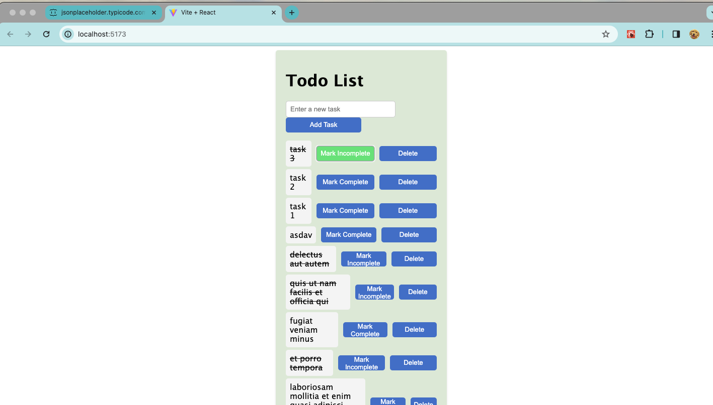

# Project-1-Task-Manager

Simple Task Manager List Application

This is a simple Task Manager List application built using React and styled with native CSS.

Project Overview

The project aims to create a functional Task Manager List application using React and enhance its visual appearance with native CSS styling.

# Features
<ul> 
<li>Add Task </li>
<li>Delete Task</li>
<li>Complete Task</li>
</ul>

# ScreenShot 
 